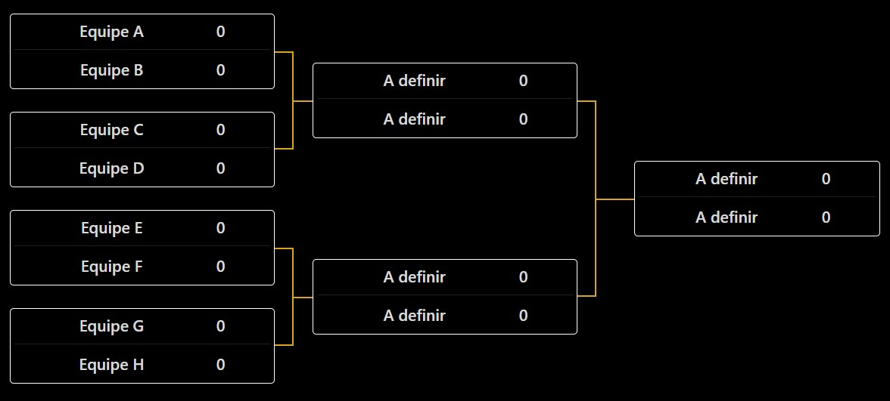

# 4th Left 4 Dead 2 Tournament - ZoneMod

[ Versión en español](README.es.md)

[ Versão em português](README.md)

## Overview
Welcome to the Left 4 Dead 2 Tournament using the **ZoneMod** game mode! This tournament brings together players from all over Brazil in a fierce competition. Below are the important details about the tournament:

- **Server Files:** [GitHub - L4D2 Zone Server](https://github.com/altair-sossai/l4d2-zone-server)
- **Server IP:** `181.214.221.198:27015`
- **Official Tournament Website:** [https://torneio.l4d2.com.br/](https://torneio.l4d2.com.br/)
- **Tournament Organizer:** [Altair Sossai](https://steamcommunity.com/id/altairsossai/)
- **Contact via WhatsApp:** +55 (19) 99698-8174

## Team Formation
- The tournament will feature **8 teams**, each consisting of **4 players**, totaling **32 players**.
- There will be no substitute players unless absolutely necessary.
- The tournament administration will select the **8 best players** as captains. These captains will participate in a draw to determine the order of player selection.
- The draw will follow a serpentine format (1-8, 8-1) until all teams are complete.
- The draw date will be communicated to the captains in advance.
- Each team must designate a player as the focal point for communication between the administration and the team.

## Competition Format
- The tournament will follow a **single-elimination** format with **best of three (Bo3)** matches.
- Teams will be paired (e.g., Team A vs. Team B, Team C vs. Team D), and the winner of each match advances in the competition.
- The team that loses the Bo3 will be eliminated from the tournament.

## Campaign Selection
- Each team must choose a campaign to play. If a third match is necessary, the campaign will be selected by a draw.
- Each campaign can only be chosen once per team during the tournament. For example, if a team selects "Dark Carnival" for the first game, that campaign cannot be selected again until the end of the tournament.
- If a team wins the first two matches, the third game will not be played.

## Campaigns
- No custom campaigns will be used, only the **original campaigns** from the game.
- All campaigns can be chosen for matches, with ZoneMod configuring the campaigns differently from Vanilla. The Zone format will be used.

## During the Matches
- A delay of up to **15 minutes** will be tolerated for the start of the match. After this period, the administration must start the game using the `!forcestart` command.
- Each team can request up to 3 pauses using the `!pause` command.
- Pauses should not exceed **5 minutes**; otherwise, the administration must use the `!forceunpause` command.
- At the start of each round, teams must use the `!ready` command within **5 minutes**. After this period, the administration must start the game using the `!forcestart` command.

## Match Dates
- Teams must mutually agree on the dates of their matches.
- After the date is confirmed between the two teams, rescheduling is only possible if both teams agree.
- Matches should preferably take place **on Fridays, Saturdays, or Sundays after 7 PM**.

## Rules
- Respect between teams is paramount. **Insults** will not be tolerated.
- Players who intentionally exploit **bugs** will be disqualified.
- Administrators should interfere as little as possible in the matches.
- **Cheating and hacks** are strictly prohibited.

## Broadcasts
- Broadcasts will be made via **Twitch** on the official tournament channel: [TorneioL4D2 - Twitch](https://www.twitch.tv/torneiol4d2).
- Matches will be available on **YouTube**: [Torneio Left 4 Dead 2 Brasil - YouTube](https://www.youtube.com/@TorneioLeft4Dead2Brasil).

## Interested in Participating?
- Contact via WhatsApp: +55 (19) 99698-8174  
- Or through the Steam profile: [Altair Sossai](https://steamcommunity.com/id/altairsossai/)