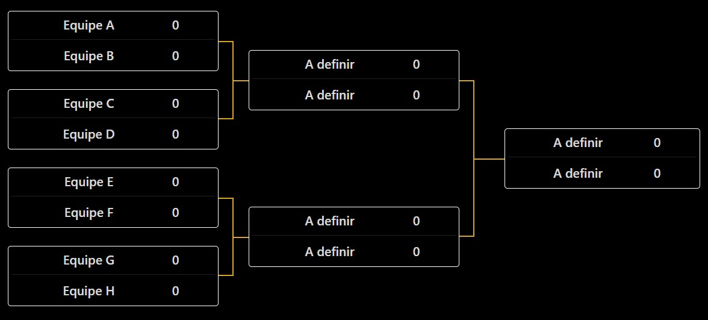

# 4° Torneio de Left 4 Dead 2 - ZoneMod

[ English Version](README.en.md)

[ Versión en español](README.es.md)

## Visão Geral
Bem-vindo ao Torneio de Left 4 Dead 2 utilizando o modo de jogo **ZoneMod**! Este torneio reúne jogadores de todo o Brasil em uma competição acirrada. 
Abaixo estão as informações importantes sobre o torneio:

- **Arquivos do servidor:** [GitHub - L4D2 Zone Server](https://github.com/altair-sossai/l4d2-zone-server)
- **IP do servidor:** `181.214.221.198:27015`
- **Site oficial do torneio:** [https://torneio.l4d2.com.br/](https://torneio.l4d2.com.br/)
- **Responsável pelo torneio:** [Altair Sossai](https://steamcommunity.com/id/altairsossai/)
- **Contato via WhatsApp:** (19) 99698-8174

## Formação das Equipes
- O torneio contará com **8 equipes**, cada uma composta por **4 jogadores**, totalizando **32 jogadores**.
- Não haverá jogadores substitutos, a menos que seja absolutamente necessário.
- A administração do torneio selecionará os **8 melhores jogadores** como capitães. Estes capitães participarão de um sorteio para definir a ordem de escolha dos jogadores.
- O sorteio será em formato de serpentina (1-8, 8-1) até que todas as equipes estejam completas.
- A data do sorteio será comunicada aos capitães com antecedência.
- Cada equipe deve designar um jogador como ponto focal de comunicação entre a administração e o time.

## Formato da Competição
- O torneio seguirá o formato **mata-mata** em jogos de **melhor de três (md3)**.
- As equipes serão emparelhadas (exemplo: equipe A vs. equipe B, equipe C vs. equipe D) e a vencedora de cada confronto avança na competição.
- A equipe que perder a md3 será eliminada do torneio.

## Escolha das Campanhas
- Cada equipe deverá escolher uma campanha para jogar. Caso seja necessário um terceiro jogo, a campanha será definida por sorteio.
- Cada campanha só pode ser escolhida uma única vez por equipe durante o torneio. Por exemplo, se a equipe escolher "Dark Carnival" para o primeiro jogo, essa campanha não poderá ser escolhida novamente até o final do torneio.
- Se uma equipe vencer as duas primeiras partidas, o terceiro jogo não será realizado.

## Campanhas
- Não serão usadas campanhas customizadas, apenas as **campanhas originais** do jogo.
- Todas as campanhas podem ser escolhidas para os jogos, lembrando que o ZoneMod configura as campanhas de forma diferente do Vanilla. Será utilizado o formato Zone.

## Durante os jogos
- Será tolerado um atraso de até **15 minutos** para o início da partida. Após esse período, a administração deve iniciar o jogo usando o comando `!forcestart`.
- Cada equipe poderá solicitar até 3 pausas usando o comando `!pause`.
- As pausas não devem exceder **5 minutos**; caso contrário, a administração deverá utilizar o comando `!forceunpause`.
- No início de cada round, as equipes devem utilizar o comando `!ready` dentro de **5 minutos**. Após esse período, a administração deve iniciar o jogo usando o comando `!forcestart`.

## Datas dos Jogos
- As equipes devem, em comum acordo, definir as datas dos seus jogos.
- Após a confirmação da data entre as duas equipes, só será possível remarcar se ambas concordarem.
- Os jogos devem ocorrer preferencialmente **às sextas, sábados ou domingos após as 19h**.

## Regras
- O respeito entre as equipes é fundamental. **Ofensas** não serão toleradas.
- Jogadores que explorarem **bugs de forma intencional** serão desclassificados.
- Os administradores devem interferir o mínimo possível nos jogos.
- **Trapaças e cheats** estão estritamente proibidos.

## Transmissões
- As transmissões serão feitas pela **Twitch** no canal oficial do torneio: [TorneioL4D2 - Twitch](https://www.twitch.tv/torneiol4d2).
- Os jogos ficarão disponíveis no **YouTube**: [Torneio Left 4 Dead 2 Brasil - YouTube](https://www.youtube.com/@TorneioLeft4Dead2Brasil).

## Deseja participar?
- Entre em contato pelo WhatsApp: (19) 99698-8174  
- Ou através do perfil na Steam: [Altair Sossai](https://steamcommunity.com/id/altairsossai/)