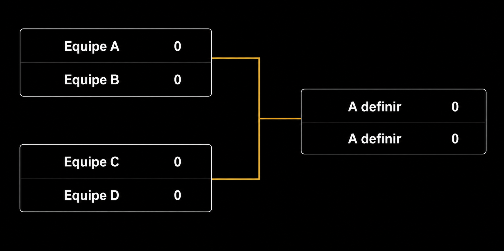

# Torneio de Left 4 Dead 2 2026 - ZoneMod v2.9.1b

[ English Version](README.en.md)

[ Versión en español](README.es.md)

## Visão Geral

Bem-vindo ao Torneio de Left 4 Dead 2 2026, disputado no modo de jogo **ZoneMod v2.9.1b**. Esta edição terá um formato mais curto e dinâmico, com **16 jogadores**, divididos em **4 equipes** de 4 jogadores.

- **Formato:** mata-mata, com semifinais e final em melhor de três (MD3)
- **Total de jogadores:** 16
- **Total de equipes:** 4
- **Data do torneio:** a definir
- **Premiação:** a definir
- **Arquivos do servidor:** [GitHub - L4D2 Zone Server](https://github.com/altair-sossai/l4d2-zone-server)
- **IP do servidor:** `124.198.128.93:27015`
- **Site oficial do torneio:** [https://torneio.l4d2.com.br/](https://torneio.l4d2.com.br/)
- **Responsável pelo torneio:** [Altair Sossai](https://steamcommunity.com/id/altairsossai/)
- **Contato via WhatsApp:** (19) 99698-8174

## Formação das Equipes

- A administração selecionará **4 capitães**, considerados os 4 melhores jogadores entre os 16 participantes.
- Será realizado um sorteio para definir a ordem de escolha dos capitães.
- As escolhas seguirão o formato **serpentina (vai e volta)**: na primeira rodada, a ordem será **A, B, C, D**; na rodada seguinte, será **D, C, B, A**.
- A ordem continuará alternando dessa forma até o encerramento das escolhas.
- As escolhas continuarão até que cada capitão tenha selecionado 3 jogadores e as 4 equipes estejam completas, com 4 jogadores cada.
- Depois de formadas, as equipes terão seus elencos definidos para todo o torneio.

## Formato da Competição

- As 4 equipes começarão diretamente nas **semifinais**.
- Um sorteio definirá os confrontos da chave.
- A **Equipe A** enfrentará a **Equipe B**, enquanto a **Equipe C** enfrentará a **Equipe D**.
- Todas as séries serão disputadas em formato **MD3**.
- As equipes vencedoras das semifinais avançarão para a final.
- A final seguirá o mesmo formato MD3 e definirá a equipe campeã.
- A equipe que perder uma MD3 será eliminada do torneio.

## Escolha das Campanhas

- Em cada MD3, uma equipe escolherá a primeira campanha e a outra escolherá a segunda.
- Se a série ficar empatada em 1 a 1, a terceira campanha será definida por sorteio.
- Se uma equipe vencer as duas primeiras partidas, a terceira não será disputada.
- Cada campanha poderá ser escolhida apenas uma vez por equipe durante o torneio. A campanha definida por sorteio não contará como escolha da equipe.

## Campanhas

- Não serão usadas campanhas customizadas, apenas as **campanhas originais** do jogo.
- Todas as campanhas originais poderão ser escolhidas, considerando as configurações próprias do **ZoneMod v2.9.1b**.

## Versão do Modo de Jogo

- A versão definida inicialmente para o torneio é a **ZoneMod v2.9.1b**.
- Caso sejam disponibilizadas atualizações, patches de segurança, correções ou outras melhorias relevantes, a organização poderá aplicá-los. Nesse caso, a versão do **ZoneMod v2.9.1b** utilizada no torneio poderá ser atualizada para uma versão superior.

## Substituições e Presença

- **Não haverá jogadores substitutos.**
- Depois da formação das equipes, a desistência ou ausência de um jogador não dará direito a reposição.
- A equipe afetada deverá jogar somente com os integrantes presentes. Caso não dispute o confronto, será desclassificada.

## Durante os Jogos

- Será tolerado um atraso de até **15 minutos** para o início da partida. Após esse período, a administração poderá iniciar o jogo usando o comando `!forcestart`.
- Cada equipe poderá solicitar até 3 pausas usando o comando `!pause`.
- As pausas não deverão exceder **5 minutos**. Após esse período, a administração poderá utilizar o comando `!forceunpause`.
- No início de cada round, as equipes deverão utilizar o comando `!ready` dentro de **5 minutos**. Após esse período, a administração poderá iniciar o jogo usando o comando `!forcestart`.

## Data e Premiação

- A data do torneio ainda será definida e divulgada pela organização.
- A premiação ainda será definida e divulgada pela organização.

## Regras Gerais

- Jogadores que explorarem **bugs de forma intencional** poderão ser desclassificados.
- Os administradores deverão interferir o mínimo possível nos jogos.
- Situações não previstas neste regulamento serão avaliadas pela administração do torneio.

## Transmissões

- As transmissões serão feitas pela **Twitch** no canal oficial do torneio: [TorneioL4D2 - Twitch](https://www.twitch.tv/torneiol4d2).
- Os jogos ficarão disponíveis no **YouTube**: [Torneio Left 4 Dead 2 Brasil - YouTube](https://www.youtube.com/@TorneioLeft4Dead2Brasil).

## Deseja Participar?

A participação será limitada aos 16 jogadores selecionados.

- Entre em contato pelo WhatsApp: (19) 99698-8174
- Ou pelo perfil na Steam: [Altair Sossai](https://steamcommunity.com/id/altairsossai/)
