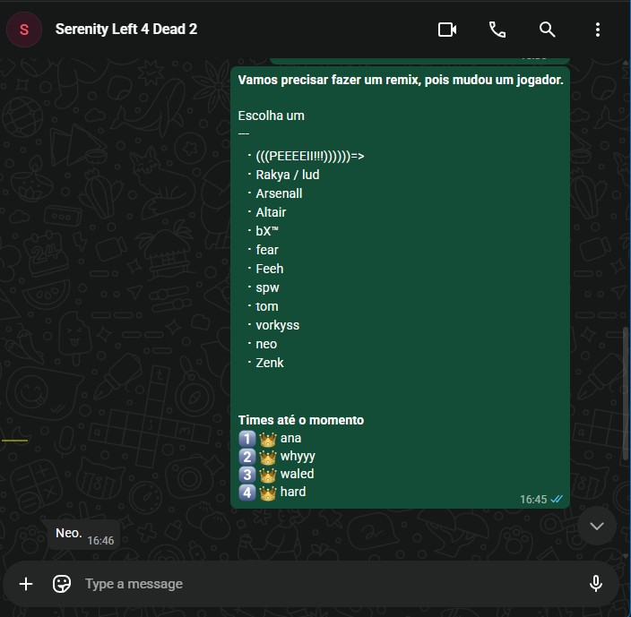
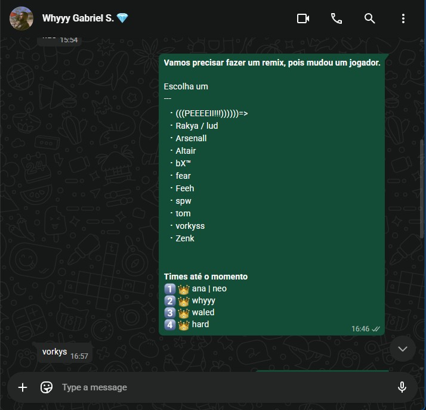
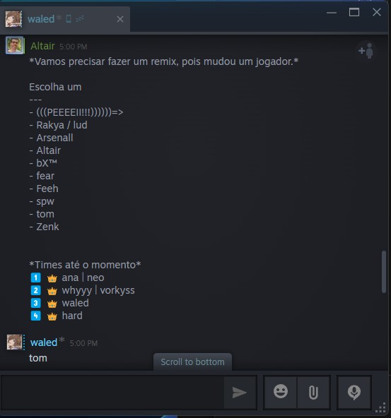
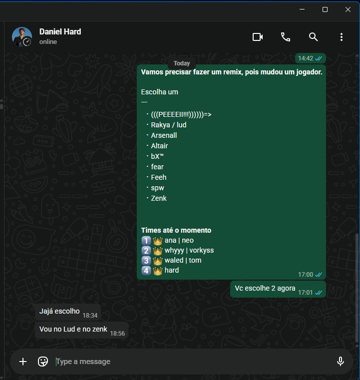
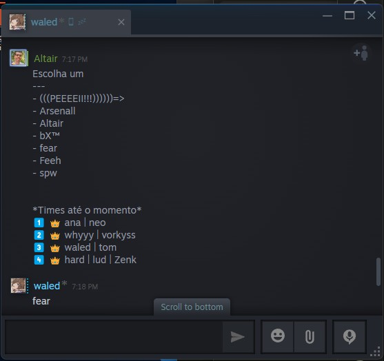
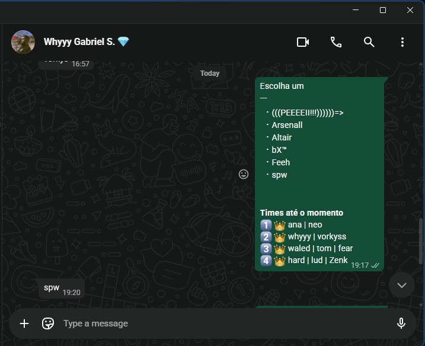
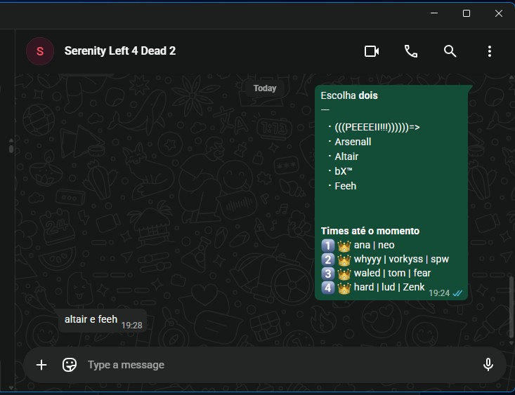
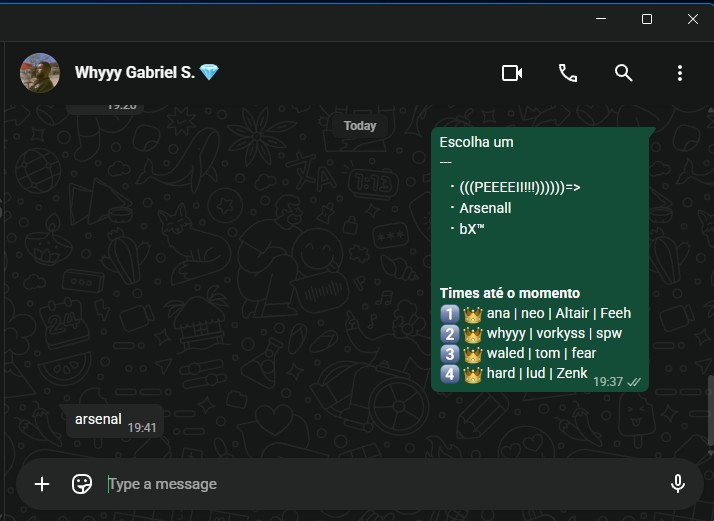
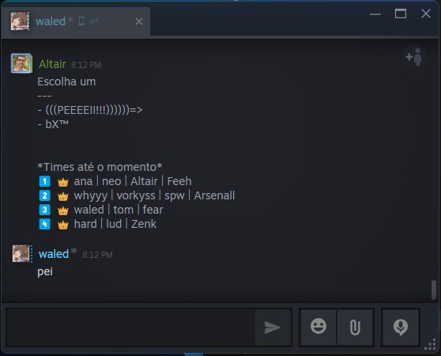

# Registro das Escolhas dos Times — Draft 2026

Esta pasta guarda os **prints das conversas** que a administração (Altair) teve com cada capitão para conduzir o draft do Torneio de Left 4 Dead 2 - 2026. As escolhas foram feitas **individualmente**, capitão por capitão, seguindo a **ordem serpentina** definida no sorteio.

- **ana**, **whyyy** e **hard** foram contatados pelo **WhatsApp**.
- **waled** foi contatado pela **Steam**.

> **Remix do draft:** um jogador do grupo mudou — **(LoD) Adeilson saiu e entrou o Rakya / lud** —, então o draft foi **refeito do zero**. Por isso os prints começam com a mensagem *"Vamos precisar fazer um remix, pois mudou um jogador."*

A cada rodada, o admin enviava para o capitão da vez a lista de **jogadores ainda disponíveis** e o quadro de **"Times até o momento"**, e o capitão respondia com o nome do jogador escolhido. Nas viradas da serpentina (quando o mesmo capitão escolhe duas vezes seguidas), ele escolhia **2 jogadores de uma vez**.

> Documento principal do draft: [../DRAFT-2026.md](../DRAFT-2026.md) · Regulamento: [../README.md](../README.md)

## Ordem do Draft (serpentina)

| # | Capitão | Escolha | Print |
| - | ------- | ------- | ----- |
| 1️⃣ | ana | neo | [01](escolha-times-01.jpg) |
| 2️⃣ | whyyy | vorkyss | [02](escolha-times-02.jpg) |
| 3️⃣ | waled | tom | [03](escolha-times-03.jpg) |
| 4️⃣ | hard | Rakya / lud | [04](escolha-times-04.jpg) |
| 5️⃣ | hard | Zenk | [04](escolha-times-04.jpg) |
| 6️⃣ | waled | fear | [05](escolha-times-05.jpg) |
| 7️⃣ | whyyy | spw | [06](escolha-times-06.jpg) |
| 8️⃣ | ana | Altair | [07](escolha-times-07.jpg) |
| 9️⃣ | ana | Feeh | [07](escolha-times-07.jpg) |
| 🔟 | whyyy | Arsenall | [08](escolha-times-08.jpg) |
| 1️⃣1️⃣ | waled | (((PEEEEII!!!))))))=> | [09](escolha-times-09.jpg) |
| 1️⃣2️⃣ | hard | bX™ | *(último jogador restante — sem print)* |

---

## Passo a passo

### 1️⃣ ana escolhe **neo** — WhatsApp

O admin reabre o draft avisando do remix e envia a lista atualizada dos 12 jogadores disponíveis (já com o Rakya / lud no lugar do Adeilson). A ana, primeira na ordem do sorteio, responde **"Neo."**.

### 2️⃣ whyyy escolhe **vorkyss** — WhatsApp

Com a ana já definida (`ana | neo`), o admin envia a lista atualizada e o quadro dos times para o whyyy, que responde **"vorkys"**.

### 3️⃣ waled escolhe **tom** — Steam

Agora pela Steam, o admin envia a lista e o quadro (`ana | neo`, `whyyy | vorkyss`) para o waled, que responde **"tom"**.

### 4️⃣5️⃣ hard escolhe **Rakya / lud** e **Zenk** — WhatsApp (virada da serpentina)

O hard é o último da rodada 1 e, por isso, abre a rodada 2 na sequência — escolhendo **2 jogadores de uma vez**. O admin avisa *"Vc escolhe 2 agora"*; o hard responde *"Jajá escolho"* e, em seguida, **"Vou no Lud e no zenk"**.

### 6️⃣ waled escolhe **fear** — Steam

A serpentina volta e é a vez do waled de novo. Com o quadro atualizado (`hard | lud | Zenk`), ele responde **"fear"**.

### 7️⃣ whyyy escolhe **spw** — WhatsApp

Com `waled | tom | fear` fechado, o admin envia a lista para o whyyy, que responde **"spw"**.

### 8️⃣9️⃣ ana escolhe **Altair** e **Feeh** — WhatsApp (virada da serpentina)

A ana fecha a rodada 2 e abre a rodada 3, escolhendo **2 de uma vez**. O admin pede *"Escolha dois"* e a ana responde **"altair e feeh"**.

### 🔟 whyyy escolhe **Arsenall** — WhatsApp

Restando poucos jogadores (PEEEEII, Arsenall, bX™), o admin envia a lista para o whyyy, que responde **"arsenal"**.

### 1️⃣1️⃣ waled escolhe **(((PEEEEII!!!))))))=>** — Steam

Sobrando PEEEEII e bX™, o admin envia para o waled, que responde **"pei"**.

### 1️⃣2️⃣ hard fica com **bX™** — último pick automático

Com todas as outras escolhas feitas, resta apenas o **bX™**, que completa a Equipe D do hard. Este pick não tem print por ser o único jogador restante.

---

## Times finais

| Equipe | Capitão | Jogadores |
| ------ | ------- | --------- |
| 1️⃣ Equipe A | 👑 ana | neo · Altair · Feeh |
| 2️⃣ Equipe B | 👑 whyyy | vorkyss · spw · Arsenall |
| 3️⃣ Equipe C | 👑 waled | tom · fear · (((PEEEEII!!!))))))=> |
| 4️⃣ Equipe D | 👑 hard | Rakya / lud · Zenk · bX™ |
